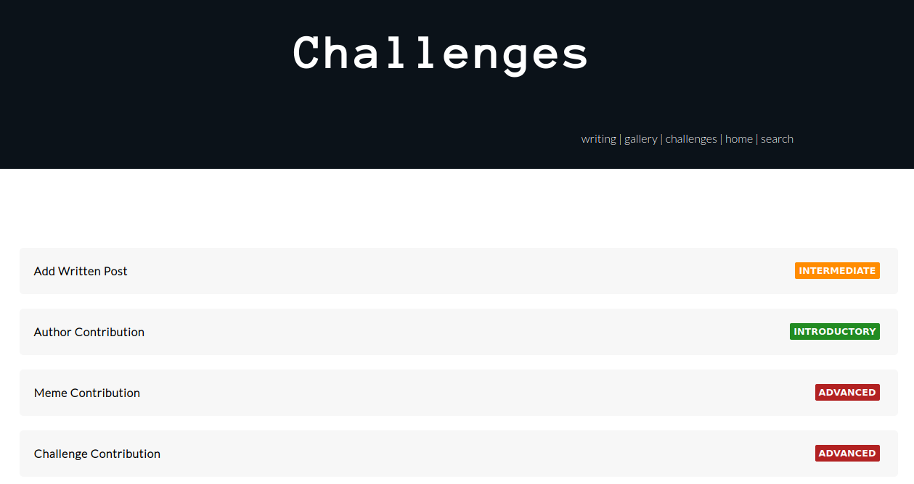
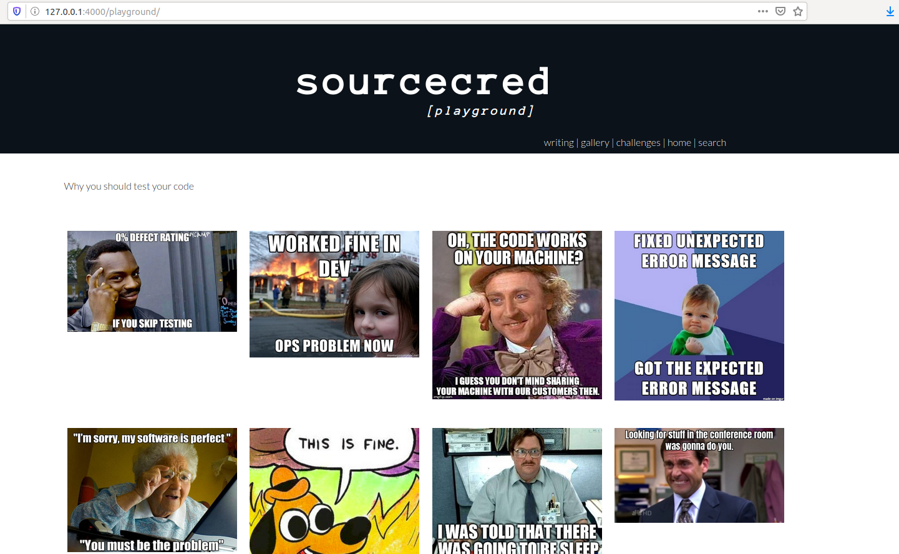

# SourceCred Playground

[](https://github.com/sourcecred/playground/actions?query=branch%3Amaster+workflow%3ACI)



Welcome to the SourceCred Playground! If you are a new contributor,
you can use this repository to try your first interactions with GitHub.
See the [web interface](https://sourcecred.github.io/playground/) 
for the contributed content and challenges,
or [browse the challenges here](_challenges) by level, or continue reading
to understand more about contributing to this repository (outside of challenges).


## Challenges

### How do I add a new challenge?

Each challenge is a markdown file under [_challenges](_challenges), organized
in a subfolder based on the level:

 - introductory
 - intermediate
 - advanced

By way of placing the markdown file in the folder, it will be labeled appropriately
on the rendered site. Thus, to add a new challenge, you can simply use an existing
challenge file as a template, and copy it to the folder of your choice. You should:

 - Give the markdown file a meaningful name
 - Do not include any uppercase character, or characters other than a dash "-" in the names
 - include the front end matter (the seconds at the top) that you see in the other challenges.

The above points will be tested using the continuous integration setup, as
an extra sanity check.

### Challenge Levels

The contributor is able to choose the level of challenge, and is
welcome to do as many or few as desired. For example, a new contributor might start
with the introductory challenge, and once they are used to working with
GitHub, work their way up to an intermediate challenge. A more advanced contributor
might do more than one challenge, mainly for fun, and possibly contribute a new
challenge for others to do.

#### Introductory

If you are completely new to GitHub, this level is for you! Introductory
challenges come down to adding a line of content to existing files.
Take a look at the introductory challenges [here](_challenges/introductory/).

#### Intermediate

Intermediate challenges usually come down to introductory challenges with
a little extra work. For example, you might add a few lines to an existing
file, but you might also add an image to a folder. Another example
might be to add a new file that renders into a post for the site.
You can see the intermediate challenges [here](_challenges/introductory/).

#### Advanced

Advanced challenges require much more than adding files or content to existing
files. They might be high level actions like adding a new challenge all together,
changing some design or style on the site, or proposing a new initiative all together.

While we provide these levels for general guidance, you are in no way limited to
them! You are free to do as many or as few challenges as you wish, and from any
set of levels. The levels are simply provided as a best effort grouping to 
help you choose.

## Testing

### Preview

The CircleCI workflow represented in [.circleci/config.yml](.circleci/config.yml)
will build a preview of the site on any pull request. After running and passing, if you click
on the check in the pull request, the "Artifacts" tab in the [CircleCI interface](https://circleci.com/gh/sourcecred/playground/) will have an index.html
that will take you to the main page. Note that for paths that look like this:

```
/playground/gallery/
```

Since CircleCI only can render static files (and not a web server) to preview you'll
need to go to:

```
/playground/gallery/index.html
```

### Automation

We use automated testing to ensure that the contributed memes and posts 
have required metadata. Tests are run with GitHub actions using [.github/workflows/main.yml](.github/workflows/main.yml), and specific tests include:

 - [tests/test_challenges.py](tests/test_challenges.py): ensures that challenges are located in an appropriate subdirectory, and have all required metadata.
 - [tests/test_posts.py](tests/test_posts.py): also tests front end matter for the posts, and that filenames and organization is correct.
 - [tests/test_gallery.py](tests/test_gallery.py)

If you find some consistent level of error with the site, you should [open an issue](https://github.com/sourcecred/playground/issues) to discuss how testing can be improved for it.

### Local Testing

If you want to run a web server locally, you'll need to follow the instructions
to [install jekyll](https://jekyllrb.com/docs/installation/). Then you can
generally cd into the repository, install dependencies:

```bash
bundle install
```

and run the server!

```bash
bundle exec jekyll serve
```

This can be complicated so it's not required - a preview will be generated with
continuous integration that you can preview.

### Containers

For advanced users, you might want to preview your changes locally, and this can
be done easily with Docker! First, build the container that has jekyll with ruby:

```bash
$ docker build -t playground .
```

The entrypoint is to run a webserver with Jekyll, and files for the repository
are added when you build the container. This means that you can build once,
and then run using the files inside. Note that we expose port 4000, which is Jekyll's
default port.

```bash
$ docker run -p 4000:4000 playground
```

You can then open the browser to `http://127.0.0.1:4000/playground/` to see
the interface!




If you want to deploy changes that you are actively working on, you can bind
your directory with the repository to `/code` in the container, and 
the interface will update with changes.

```bash
$ docker run -v $PWD/:/code -p 4000:4000 playground
```

**Important** if you shell inside the container when the repository is mounted, 
do not save files from within it, as you could change permissions as the root user. If for any reason you need to shell inside to test things, you can do:

```bash
$ docker run -it --entrypoint /bin/sh -p 4000:4000 playground
```

And then you will be in the working directory `/code` with previously
added files. You can run the server manually from here:

```bash
$ bundle exec jekyll serve --host 0.0.0.0
```

Note that exposing 0.0.0.0 will be accessible at 127.0.0.1 on the host.
Happy continering!
